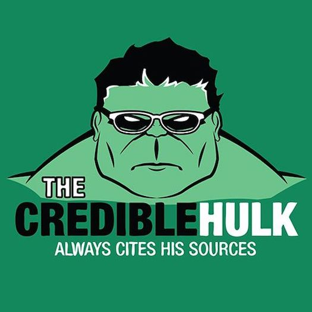

class: title, smokescreen, shelf, no-footer
background-image: url(html5.jpg)

# HTML5
### <br />September 2, 2019

---

# The Politics of Web Design

## [#reactgate](https://www.businessinsider.com/reactgate-react-facebook-code-of-conduct-twitter-2019-8) :

> React, a popular open source project that started at Facebook, is adopting a new code of conduct after several people on Twitter called out racism in the community

---
class: col-2 compact

# Review

## HTML
* A "markup" language for the **"content"** of a website<br /><br />
* Conveys semantic meaning (relative importance/unimportance, type of content)<br /><br />
* Should NOT contain design elements (e.g. using tables for layout)<br><br><br><br>

## HTML5 Boilerplate
```html
<!DOCTYPE html>
<html>

<head>
    <meta charset="UTF-8">
    <title>Title of the document</title>
</head>

<body>
    Content of the document......
</body>

</html>
```

---
class: compact
# Anatomy of an HTML Element

### Element with Closing Tag

```html
<tag attribute="some_attribute">Content</tag>

<!-- example -->
<h1 class="huge">Why I'm Awesome</h1>

```

### Self-Closing Element

```html
<tag attribute="some_attribute">
<!-- older versions of HTML used <tag attribute="some_attribute" /> -->

<!-- examples -->

<br>

```

---
# Comments as Citation



---

# A few good HTML5 Resources:

* https://www.quackit.com/html/tags/
* https://websitesetup.org/html5-cheat-sheet/

---
class: col-2

# <q>Nested</q> HTML

## Properly Nested

```html
<nav>
<ul>
<li>Menu1</li>
<li>Menu2</li>
</ul>
</nav>
```
<br><br><br><br>
## Improperly Nested

```html
<nav>
<ul>
<li>Menu1
<li>Menu2</li>
</li>
</nav>    
</ul>
```
---
# Best Practice:  Indentation
[helps identify nesting issues; Brackets has a <q>Beautify<q> extension]

```html
<nav>
    <ul>
        <li>Menu1</li>
        <li>Menu2</li>
    </ul>
</nav>
```

---
class: compact

# Commonly Misunderstood HTML Elements

* **`<em></em>` vs. `<i></i>`**<br>
<em>&lt;em&gt;</em> is <em>verbally emphatic</em> whereas <i>&lt;i&gt;</i> is used for visual attention and/or use cases like bibliographic citation<br><br>
Olson, M. (2019). Demystifying Commonly Misunderstood HTML Elements. <i>American Journal of Web Semantics, 27</i>(2), 100-110.

* **`<strong></strong>` vs. `<b></b>`**<br> 

    * <strong>&lt;strong&gt;</strong> is more strongly verbally emphatic than <em>&lt;em&gt;</em><br><br>
    * <b>&lt;b&gt;</b> is used for visual attention, such as highlighting a keyword:<br><br>
    HTML5 is <b>semantic</b>, that is, the elements you choose convey meaning.

---
class: col-2 compact
# Content Models

### Prior to HTML5:<br><br>

* Block<br>(e.g. `<h1>`, `<p>`, `<ul>`, ``, `<div>`, etc.)<br><br>
* Inline<br>(e.g. `<em>`, `<span>`, `<cite>`, `<b>`, etc.)_<br><br><br><br>

### HTML5:
[](https://www.w3.org/TR/2011/WD-html5-20110525/content-models.html)
---
class: compact
### HTML5 Content Model, cont'd

* **Metadata** - content in `<head>` for presentation of the document or its relation to other documents<br><br>
* **Flow** - most elements that are used in the `<body>` of the document<br><br>
* **Heading** - defines the header of a section (`<h1>...<h6>`, `<hgroup>`)<br><br>
* **Sectioning** - defines the scope of content blocks (`<nav>`, `<section>`, `<article>`, `<aside>`)<br><br>
* **Phrasing** - the text of the document &amp; elements that mark up that text at the intra-block level. (many: `<sub>`, `<cite>`, `<span>`, etc.)<br><br>
* **Embedded** - imports another resource into the document (`<audio>`, `<canvas>` `<embed>`, `<iframe>`, `<video>`, etc.)<br><br>
* **Interactive** - content that is specifically intended for user interaction

---
class: img-left compact

# File Paths


### Path: index.html &rarr; darning.jpg

* **Full:**<br>https://www.mysite.com/images/skills/darning.jpg

* **Root Relative:**<br>/images/skills/darning.jpg

* **File relative:**<br>images/skills/darning.jpg<br>
    &nbsp;&nbsp;&nbsp;&nbsp;-or-<br>./images/skills/darning.jpg

---
class: img-left compact

# File Paths


### Path: /skills/index.html &rarr; darning.jpg

* **Full:**<br>https://www.mysite.com/images/skills/darning.jpg

* **Root Relative:**<br>/images/skills/darning.jpg

* **File relative:**<br>../images/skills/darning.jpg

---
class:
## For Lab #1 this week:

* Complete Lab Assignment #1: `about-me.html` (Don't forget to [validate your code](https://validator.w3.org/)!)<br><br>
* Read the following:
    * **[W3schools.com "CSS Tutorial"](https://www.w3schools.com/css/css_intro.asp)** - from the **CSS Introduction** section _through and including_ the **CSS Fonts** section)
    * Rachel Andrew’s ["How to Learn CSS"](https://www.smashingmagazine.com/2019/01/how-to-learn-css/)


