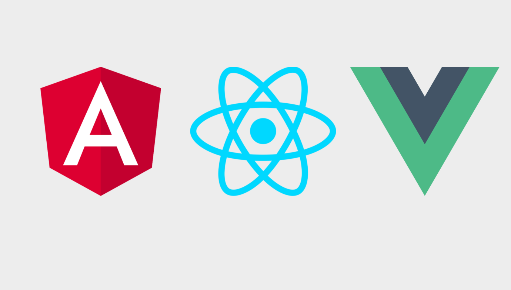

class: title smokescreen shelf no-footer compact
background-image: url(https://cdn.elearningindustry.com/wp-content/uploads/2018/08/what-is-the-future-of-web-scraping-for-android-apps-1024x574.jpg)

# The Future Web:
## Frameworks, Web Assembly, Pyodide, WebXR December 2, 2019

---

# Some CSS Frameworks

* [Bootstrap](https://getbootstrap.com/)  
* [Bulma](https://bulma.io/)  
* [UIKit](https://getuikit.com/)  
* [SemanticUI](https://semantic-ui.com/)  
* [MaterializeCSS](https://materializecss.com/)

---
class: img-caption

### Javascript Frameworks React vs. Angular vs. Vue

???

React - Facebook, originally released in 2013; uses JSX, an HTML-like syntax; moderate learning curve

Angular - developed by Google, was first released in 2010, uses Typescript; v2 - 2016; steepest learning curve

Vue - ex-Google employee; tiny size; small but growing; easiest to learn but can get by with terrible code, making debugging and testing difficult

---

# Javascript Frameworks

* Unlike a javascript library which is implemented within a "vanilla" HTML and CSS site, a framework defines the entire web application design.  You build the entire site within the vernacular of the framework.  
* A framework often enables the development of "cross-platform" applications - a single codebase which works across web, mobile web, mobile &amp; desktop native operating systems.  
* Frameworks are component-based, stateful, and declarative.

---
class: center compact

# Web Assembly (Wasm)

   
[https://webassembly.org/](https://webassembly.org/)   

--
[https://emscripten.org/](https://emscripten.org/)

???

WebAssembly (abbreviated Wasm) is a new type of code that can be run in modern web browsers — it is a low-level assembly-like language with a compact binary format that runs with near-native performance and provides languages such as C/C++ and Rust with a compilation target so that they can run on the web. It is also designed to run alongside JavaScript, allowing both to work together.

WebAssembly is designed to complement and run alongside JavaScript — using the WebAssembly JavaScript APIs, you can load WebAssembly modules into a JavaScript app and share functionality between the two. This allows you to take advantage of WebAssembly's performance and power and JavaScript's expressiveness and flexibility in the same apps, even if you don't know how to write WebAssembly code.

Compiler for C/C++:  Emscripten

---
class: title
# Web Assembly Example

### [OpenCV.js](https://docs.opencv.org/master/df/d0a/tutorial_js_intro.html)  [https://codepen.io/huningxin/pen/NvjdeN](https://codepen.io/huningxin/pen/NvjdeN)

---
class: roomy
# Python in the Browser

* Pyodide - [https://github.com/iodide-project/pyodide](https://github.com/iodide-project/pyodide)  
* Streamlit - [https://streamlit.io/](https://streamlit.io/)

---

# WebXR

WebXR refers to the delivery of "extended reality" (XR) experiences in the brower.  XR is a concept intended to encompass both virtual reality and augmented reality applications.

Some webXR libraries include:

* [Aframe](https://aframe.io) - a well-documented library for generating VR experiences; can be extended to AR using [AR.js](https://github.com/jeromeetienne/AR.js/)

* The [Immersive Web Working Group](https://immersive-web.github.io) has published a number of [WebXR examples with source code](https://immersive-web.github.io/webxr-samples/). 

---
class: col-2
# WebXR Example - Hit Test

 <video width="50%" controls>
  <source src="AR_hit_test.mov" type="video/mp4">
Your browser does not support the video tag.
</video> 

The video at left demonstrates using the [Hit Test API](https://immersive-web.github.io/webxr-samples/proposals/) to place virtual objects on real-world surfaces.  Note how the sunflower adheres to the sidewalk.  Tapping on the phone screen places a sunflower in the world.  This demo requires the experimental web browser Chrome Canary to function on Android.  

---
# Final Project Submission

No later than noon (12 PM) on December 11

Send an email to your lab instructor and Prof. Olson with the following:

* Subject line:  Your last name, first name Final Web Project
* Body of email:  
    * URL to your final project
    * One-page site self-assessment / post-mortem reflection *in the body of the email*
    * Confirmation that you have completed the anonymous course evaluation.  

Questions?  Email us or post to Piazza!